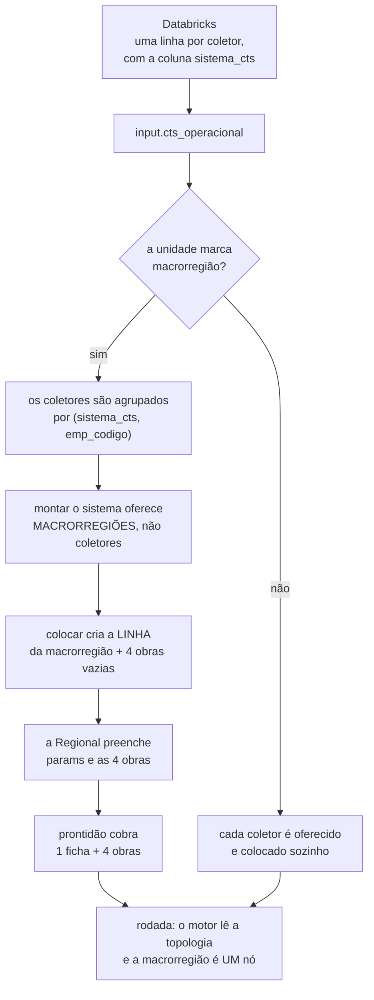
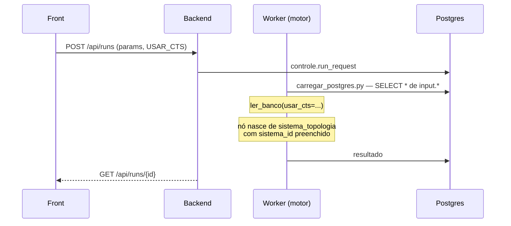

# Macrorregião de CTS — o caminho inteiro

Da caixa que a Regional marca até o número que o otimizador usa. Este documento
descreve o que EXISTE hoje; as decisões e o porquê de cada uma estão em
[ADR 0010](adr/0010-a-macrorregiao-vira-linha-ao-ser-colocada.md), e o vocabulário
em [CONTEXT.md](../CONTEXT.md).

## Antes de tudo: "CTS" nomeia três coisas

Boa parte da confusão neste assunto vem de a mesma sigla aparecer em três frases
que não têm relação entre si.

| o que se diz | o que é | onde vive |
|---|---|---|
| **CTS** | Coletor de Tempo Seco — um componente do sistema, irmão da sub-bacia | `input.cts_operacional`, uma linha por coletor |
| **Macrorregião de CTS** | REGIME de cadastro da unidade: um coletor atende à região, e cada sistema aceita UM | `input.unidade_regional.usa_macrorregiao_cts` |
| **`USAR_CTS`** | PARÂMETRO DA RODADA: a CTS existe nesta simulação? | `params_extra` do pedido de rodada |

A macrorregião é cadastro; `USAR_CTS` é simulação. Marcar a unidade não muda
rodada nenhuma, e ligar `USAR_CTS` não agrupa coletor nenhum. Um sistema
(`sistema_id`) é o conjunto de sub-bacias que escoam para a mesma ETE — outra
coisa ainda, e é por isso que a coluna se chama `sistema_cts`, com sufixo.

## O caminho, de ponta a ponta

### Etapa 0 — a carga traz a chave

O Databricks entrega **uma linha por coletor**, e nela a coluna `sistema_cts`, que
diz a que macrorregião aquele coletor pertence. Sem essa coluna não há como
agrupar: a alternativa que parece óbvia — agrupar pelo `sistema_topologia` —
responde outra pergunta (junta as CTS que já estão no mesmo sistema de esgoto) e
deixa de fora justamente as que ainda não foram colocadas.

`sistema_cts` NULO é o estado normal de quem não pertence a macrorregião nenhuma.

### Etapa 1 — a unidade declara o regime

**Front** · `Organização · Unidade e regional`, componente `UsaMacrorregiaoCts.tsx`
→ `PUT /api/unidades/{unidade_id}` com `{"usaCts": true}`.

**Back** · `salvar_unidade` grava `usa_macrorregiao_cts`. Duas recusas, e são
espelho uma da outra:

- **marcar** com algum sistema de duas CTS é recusado, nomeando quais — a unidade
  não pode declarar impossível um estado em que ela já está;
- **desmarcar** com macrorregião em sistema é recusado, nomeando onde. Desmarcada,
  os coletores membros voltariam a ser colocáveis enquanto a macrorregião que os
  SOMA continua no sistema; colocado um deles, o motor conta as mesmas ligações e
  as mesmas obras **duas vezes**. A saída é tirar a macrorregião do sistema
  primeiro — o que devolve os coletores dela à lista — e só então desmarcar. Nada
  do que foi preenchido se perde.

### Etapa 2 — montar o sistema passa a oferecer macrorregiões

**Front** · `GET /api/unidades/{u}/hierarquia` → o bloco `semSistema` alimenta o
seletor de `AdicionarCts.tsx`.

**Back** · `hierarquia` troca as CTS soltas por macrorregiões. Uma macrorregião é
oferecida quando **todas** estas valem:

| condição | por quê |
|---|---|
| nenhum MEMBRO está em sistema | colocá-la é colocar os coletores dela |
| ela própria não está em sistema | colocada, ela tem linha, e os membros continuam soltos — olhar só para eles a ofereceria de novo |
| o nome não é usado por duas empresas da unidade | o cadastro guarda um id só, e fundir somaria coletores de empresas diferentes |

O `tipo` continua `'cts'`: para a tela, a macrorregião **é** o coletor daquele
sistema. O front não aprende palavra nova, e `ehCts` continua valendo.

### Etapa 3 — colocar cria a linha

**Front** · `PUT /api/unidades/{u}/topologia/{componente_id}` (um componente) ou
`PUT /api/unidades/{u}/topologia` (o sistema inteiro — é o que a tela usa ao
gravar o desenho).

**Back** · `_preparar_macrorregiao`, nos **dois** caminhos, antes da checagem de
existência. Ela:

1. acha os membros pelo nome, dentro das cidades da unidade;
2. recusa se o nome pertence a mais de uma empresa;
3. recusa se algum membro já está em sistema;
4. cria a linha em `cts_operacional` — as 12 medidas do Databricks **somadas**,
   `cidade_id` = a do membro com mais ligações, `e_macrorregiao = true`,
   `sistema_cts` NULO (a macrorregião não é membro de si mesma);
5. cria as **4 obras vazias** em `componentes_cts_capex`;
6. registra a criação na trilha.

Criar aqui, e não ao marcar a unidade: marcar é declaração de regime, e
materializar ali encheria a base de agregados que ninguém usa — e desmarcar teria
de apagá-los, com as obras dentro.

**Colocar um MEMBRO sozinho é recusado**, nomeando a macrorregião. A tela já não o
oferece; a recusa é para quem tinha a lista antiga aberta ou chama a rota direto.

### Etapa 4 — a Regional preenche

**Front** · `GET /api/unidades/{u}/cts` devolve **uma ficha por macrorregião**, no
mesmo formato de sempre → `PUT /api/unidades/{u}/cts/{cts_id}`.

**Back** · `salvar_coleta`, sem nada de especial: para ele a macrorregião é uma
CTS. O `PUT` recusa ficha com menos de 4 obras — e é por isso que elas nascem na
etapa 3, já que a macrorregião não vem de carga nenhuma.

#### O que agrega e o que se preenche

| coluna | na macrorregião |
|---|---|
| `receita_faturada_media_mensal` | **soma** |
| `receita_arrecadada_media_mensal` | **soma** |
| `universo_ligacoes`, `ligacoes_atuais`, `ligacoes_novas_obras` | **soma** |
| `universo_economias`, `economias_atuais`, `economias_novas_obras` | **soma** |
| `universo_ligacoes_residencial`, `ligacoes_atuais_residencial` | **soma** |
| `universo_economias_residencial`, `economias_atuais_residencial` | **soma** |
| `populacao_novas_obras` | **soma** (não é modelada na tela — some sem alarde se esquecida) |
| `preco_por_ligacao` | Regional preenche |
| `tempo_arrecadacao`, `tempo_ramp_up` | Regional preenche |
| `vazao_contribuicao`, `potencial_crescimento` | Regional preenche |
| `universo_populacao`, `populacao_atual` | Regional preenche |
| as 4 obras | Regional preenche |
| `cidade_id` | a do membro com mais ligações |
| `ticket` | derivado na leitura (arrecadada ÷ ligações) — não é coluna |

A fronteira não é arbitrária: **soma-se o que o Databricks MEDE sobre uma área**,
porque a área da macrorregião é a união das áreas dos membros. **Preenche-se o
resto**, porque é informação de quem cadastra sobre o conjunto. Somar
`preco_por_ligacao` daria R$ 3.049 por ligação; somar `tempo_arrecadacao` daria 16
meses onde o maior é 12; somar `potencial_crescimento` daria 2,30 num fator que é
1,15. Nenhuma dessas contas precisa existir.

Obra também não agrega: somar `quantidade` e `preco_unitario` violaria a
constraint `capex_e_derivado`, e a média produziria números plausíveis que ninguém
digitou — o modo de falha que a recusa de `obras_da_ficha` existe para evitar.
As 4 obras nascem com **vocabulário apenas** (nome e unidade de medida).

### Etapa 5 — a prontidão

Não precisou mudar. Ela conta componente **colocado na topologia**: a macrorregião
entra por ser nó, e os membros ficam de fora por não serem. Cobra-se uma ficha e
quatro obras por macrorregião, e não por coletor.

### Etapa 6 — a rodada

O motor **não sabe o que é macrorregião**, e não precisa saber. Ele lê
`cts_operacional` inteira e monta os nós a partir de `sistema_topologia`:

- a **macrorregião** está na topologia → vira nó, com a ficha somada e as 4 obras;
- os **membros** não estão → não viram nós, e os dados deles não são lidos para
  nada;
- com `USAR_CTS=false`, qualquer CTS na topologia é pulada, e quem atende a área
  é a sub-bacia pelas colunas `*_com_cts`.

Por isso a etapa 1 recusa desmarcar com macrorregião colocada: é o único caminho
por onde a macrorregião e um membro dela estariam na topologia ao mesmo tempo.

## As recusas, num lugar só

| quando | o servidor diz |
|---|---|
| marcar a unidade com sistema de 2 CTS | quais sistemas, e quais CTS |
| desmarcar com macrorregião colocada | quais macrorregiões, e em que sistemas |
| colocar um membro sozinho | de que macrorregião ele faz parte |
| colocar macrorregião com membro já colocado | quais membros |
| colocar nome usado por duas empresas | quais empresas |
| id de coletor igual a nome de macrorregião | que os dois se chamam igual |
| `PUT` de ficha com menos de 4 obras | qual falta |

## O que NÃO acontece

- **Os coletores não somem da base.** Continuam em `cts_operacional`, com os
  números deles intactos. Deixam de ser oferecidos e de ser cobrados — nada mais.
- **A macrorregião não nasce ao marcar a unidade.** Nasce ao ser colocada.
- **A soma não é refeita a cada leitura depois de colocada.** A linha gravada é a
  ficha, e é ela que a Regional preenche e o motor lê.
- **`USAR_CTS` não tem nada a ver com isto.**

## A recarga do Databricks, e como ela é percebida

Colocada a macrorregião, a linha é a ficha, e ela **não é recalculada a cada
leitura** — senão a tela mostraria um número e a rodada usaria outro no mesmo
instante. O preço dessa escolha é ficar para trás quando uma carga posterior mexe
nos coletores. Duas peças cobrem isso:

**A prontidão avisa.** `_macrorregioes_desatualizadas` compara a ficha gravada com
a soma dos coletores de hoje e, se diferirem, emite um aviso em
`prontidao.faltando` — ao lado do aviso de caminho que não chega à ETE, porque as
duas respondem a mesma pergunta: o que a tela não tem como saber sozinha. O aviso
nomeia **quais medidas** mudaram, e não "algo mudou". Não conta pendência e não
trava a simulação: os números continuam sendo números que alguém informou, e a
rodada com eles é válida sobre uma base anterior. O que ela não pode é acontecer
sem ninguém saber.

**Gravar a ficha refaz a soma.** O bloco `db` que chega no `PUT` veio do último
`GET`, que mostra a linha gravada — regravá-lo como veio devolveria a soma velha
ao banco, e a divergência sobreviveria à única ação que a pessoa tem para
corrigi-la. As medidas do Databricks são travadas na tela, então não há nada que
alguém tenha digitado ali para ser descartado: o que se descarta é uma cópia
envelhecida do que a base comercial já diz. A trilha registra a diferença com
origem `databricks` — correção de número que veio de fora, que é exatamente o que
é.

A comparação tem folga de 0,01: as receitas são `double precision`, e somar quatro
delas em ordens diferentes pode diferir na última casa. Um alarme que dispara por
0,0000001 é um alarme que ninguém lê depois da terceira vez.

## A macrorregião não é recortada por município

`AdicionarCts.tsx` oferece só coletores da cidade do sistema — proteção legítima,
e medida: antes dela, 151 CTS livres de uma unidade eram oferecidas às cinco, e
duas foram efetivamente colocadas em sistema de outra cidade.

A macrorregião é a **exceção**, e a única. Ela atende à região e pode cruzar
município por definição, mas expõe uma cidade só, a dominante. Recortada como
coletor, sumia dos sistemas das demais cidades que atende: na base de 03/09/2026,
`MACRO_A` abrange `d1c1`, `d1c5` e `d1c13`, reporta `d1c1`, e ficava invisível nos
**20 sistemas** que a unidade tem nas outras duas — enquanto o backend a aceitava
sem reclamar.

A hierarquia passou a marcar a linha com `macro: "true"`, e o seletor deixa a
macrorregião passar pelo recorte. O `tipo` continua `"cts"`: para montar o sistema
ela **é** o coletor daquele sistema, e a tela não precisa de palavra nova para
colocá-la. O campo existe por essa razão só.
